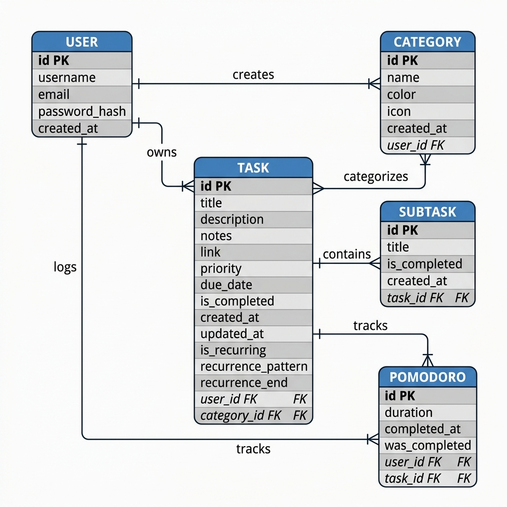
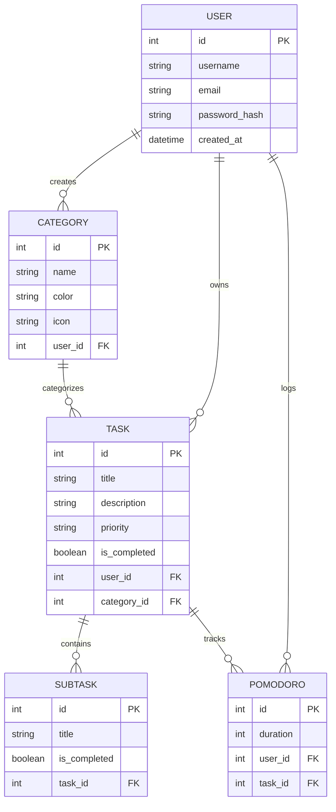
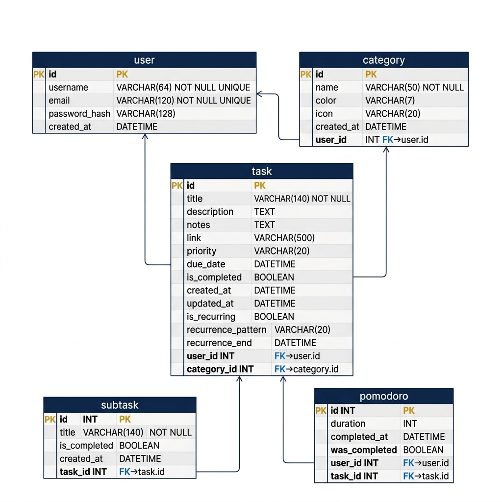
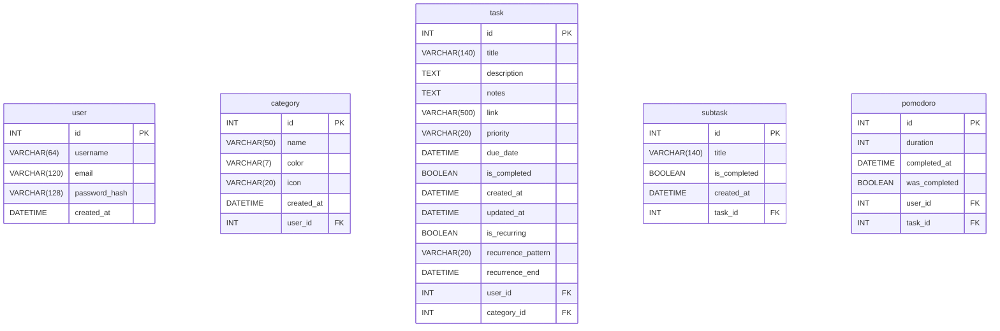

# CCCS 105 Final Project - To-Do List Application

## a. Introduction

**Background:** Time management and task tracking are essential skills for personal and academic success. This application is designed to help users manage their workload efficiently by combining a to-do list system with Pomodoro timers. 

**Problem Statement:** Many existing tools separate task management from focus sessions (Pomodoro), causing users to switch contexts frequently. This project addresses the need for an integrated system where users can organize tasks, divide them into subtasks, and track time spent on them using built-in timers.

**Scope:** The application covers user registration, categorization of tasks, CRUD operations for tasks and subtasks, and a Pomodoro timer tied to specific tasks. It does *not* cover collaborative team tasks or integration with external calendar systems.

**Target Users:** Students and professionals who need a structured way to track assignments and maintain focus during work sessions.

## b. Project Objectives

**Primary Objective:** To develop a fully functional Python-based database application using Flask and MySQL that demonstrates CRUD operations and fundamental database management concepts.

**Secondary Objectives:**
- Implement a relational database with at least 5 related tables.
- Create a responsive and intuitive user interface.
- Provide secure user authentication and data isolation (users only see their own tasks).
- Enable users to log Pomodoro focus sessions effectively.

## c. Business Rules

**Detailed Business Logic:**
- **User Authentication:** Passwords must be hashed using `werkzeug.security`. Users must be logged in to view or modify any data.
- **Data Isolation:** A user can only access, edit, or delete Tasks, Categories, and Pomodoros associated with their own `user_id`.
- **Database Connections:** The application connects to a MySQL database using SQLAlchemy (`mysql+pymysql://`).

**Constraints:**
- A Pomodoro session cannot exist without being tied to a user.
- Deleting a Task will automatically delete all its associated Subtasks and Pomodoros (CASCADE).
- Deleting a User will automatically delete all their associated Data (CASCADE).

**Conditions:**
- Users must provide a unique username and email to register.
- Tasks must have a title to be created.

## d. Database Models

### Entity Relationship Diagram (ERD)



*(Note: To generate the ERD, copy the Mermaid code below into [Mermaid Live Editor](https://mermaid.live/) and export as `erd.png` to `docs/diagrams/`)*


### Relational Model



*(Note: To generate the RM, copy the Mermaid code below into [Mermaid Live Editor](https://mermaid.live/) and export as `rm.png` to `docs/diagrams/`)*


## e. Project Overview

This project follows the **Model-View-Controller (MVC)** architectural pattern implemented via the Flask framework.
- **Model:** SQLAlchemy ORM models (`src/models.py`) represent database tables.
- **View:** HTML/Jinja2 templates (`src/templates/`) provide the user interface.
- **Controller:** Flask routes and blueprints (`src/main/`, `src/auth/`) handle user requests and business logic.

## f. Setup Instructions

**Prerequisites:**
- Python 3.8+
- XAMPP (with MySQL running)
- Git

**Step-by-Step Guide:**

1. **Clone Repository:**
   ```bash
   git clone <repository-url>
   cd <repository-folder>
   ```

2. **Database Setup (XAMPP):**
   - Open XAMPP Control Panel and start **MySQL**.
   - Open phpMyAdmin (`http://localhost/phpmyadmin/`).
   - Create a new database named `CCCS105`.
   - Import the database schema: Select `CCCS105` -> Import -> Choose `database/schema.sql`.
   - Import initial data: Select `CCCS105` -> Import -> Choose `database/initial_data.sql`.

3. **Virtual Environment & Dependencies:**
   ```bash
   python -m venv .venv
   .venv\Scripts\activate
   pip install -r requirements.txt
   ```

4. **Environment Variables:**
   - Rename `.env.example` to `.env` (if applicable) or ensure variables are set.
   - The default configuration looks for `mysql+pymysql://root:@localhost:3306/CCCS105`.

5. **Run the Application:**
   ```bash
   python run.py
   ```
6. **Access:** Open a web browser and go to `https://127.0.0.1:5000/`.

## g. Team Members & Roles

| Name | Role | Responsibilities |
| :--- | :--- | :--- |
| **[INSERT NAME]** | Backend / DB Admin | Created the database schema, models, ERD, and SQL files. |
| **[INSERT NAME]** | Frontend Developer | Designed HTML templates, CSS, and interactive UI logic. |
| **[INSERT NAME]** | Lead Programmer | Implemented Flask routes, CRUD operations, Authentication. |

*(Please replace with actual names and roles)*

## h. Dependencies

**Python Packages:**
- `Flask`
- `Flask-SQLAlchemy`
- `PyMySQL`
- `Flask-Login`
- `Flask-WTF`
- `Faker` (for mock data generation)
- `python-dotenv`

**System Requirements:**
- Windows/macOS/Linux
- Python 3.8 or higher
- XAMPP (MySQL 5.7+ or MariaDB)
- Modern Web Browser (Chrome, Firefox, Edge)

## i. Running Instructions

1. Start XAMPP MySQL.
2. Activate your virtual environment: `.venv\Scripts\activate`
3. Start the application: `python run.py`
4. The server will start on `https://127.0.0.1:5000/`.
5. You can register a new account or use one of the automatically generated accounts from the `initial_data.sql` script. (All generated accounts use the password `password123`).
6. Navigate using the top bar to create Tasks, group them by Categories, and track time with Pomodoro.
7. To stop the application, press `CTRL + C` in the terminal.

## j. Demonstration Video
- **Link:** [INSERT LINK TO VIDEO HERE]
